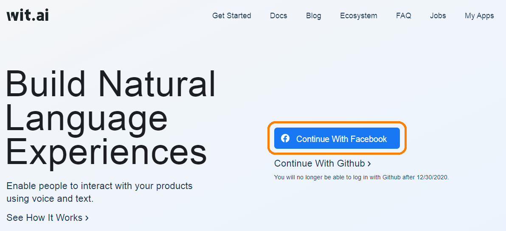
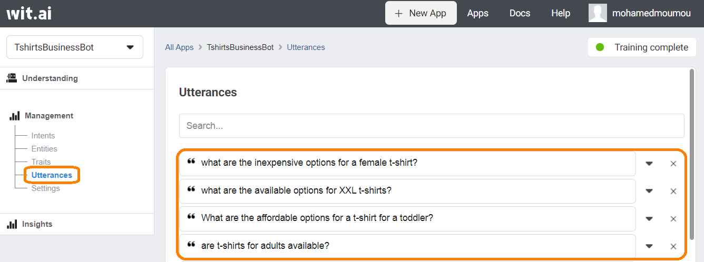
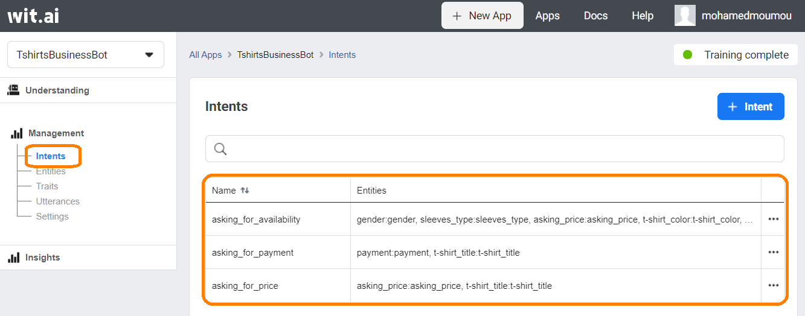
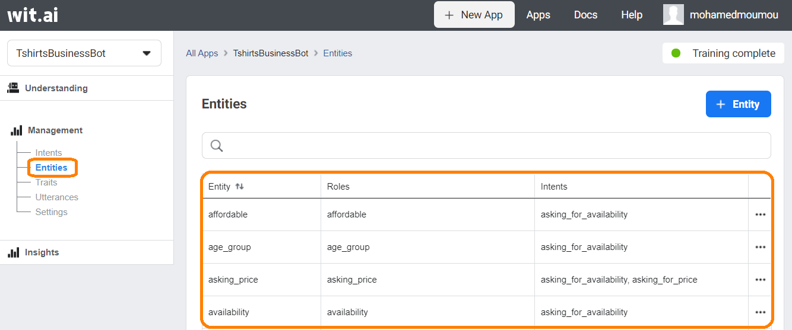
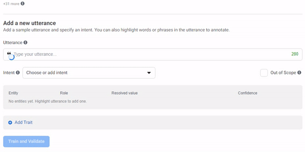

# Create a Customer Service Messenger Bot with wit.ai and the Facebook Marketing API
### Authors: Mohamed Moumou & Ouissal Moumou <br>

### Abstract

In this tutorial, we will create a Messenger bot for a company that sells T-shirts. The bot answers customers’ questions about the available products, the sizes, colors, and prices.  To do that, The bot relies on the company's Facebook catalog. 

### Table of contents
  1. [Prerequites](#Prerequites)
  2. [What is wit.ai?](#What-is-witai)
  3. [What is the Facebook Marketing API](#What-is-the-Facebook-Marketing-API)
  4. [Getting Started: Creating a wit.ai App](#Getting-Started-Creating-a-witai-App)
  5. [How does Wit.ai work?](#How-does-Witai-work)
  6. [Training the bot](#Training-the-bot)
  7. [Response of The Bot](#Response-of-The-Bot)
  8. [Linking Messenger to the wit.ai app](#Linking-Messenger-to-the-witai-app)
  9. [Handling intents](#Handling-intents)
  10. [Next Steps](#Next-Steps)
  11. [Resources](#Resources)

### Prerequites

  - You have a Facebook catalog for your products linked to a Facebook business account.
  - You have basic knowledge of NodeJS.
  - You have an E-commerce platform.


### What is wit.ai?

Wit.ai is an open and extensible NLP engine for developers, which allows building conversational applications and devices that you can talk or text to. It provides an easy interface and quick learning APIs to understand human communication from every interaction and helps to parse the complex message (which can be either voice or text) into structured data. 

### What is the Facebook Marketing API

 The **Facebook Marketing API** is an HTTP-based API that you can use to programmatically query data, create and manage ads, and perform a wide variety of other tasks. 

 In our case we will use it to query products from our catalog and specifically apply filters to query the right products depending on the customer request. For example, if the customer wants to know all the available black t-shirts with a price less than 100, we will send a GET request with a filter to only return the t-shirts that have the properties color as “black”, and price as a number less than 100. 

To use the Marketing API, you should have basic knowledge of the Facebook Grah API and how it works. You can find that [here](https://developers.facebook.com/docs/graph-api/).

### Getting Started: Creating a wit.ai App

Before we can train the bot, we need to create a new Wit.ai app that will represent the natural language processing part of the project. 
  1. Go to https://wit.ai/ and login with Facebook or GitHub.

  

  2. Click the new "app" button at the top right corner of the screen. 
  3. Choose a name for your app and also the language you will use to train the bot. 
  4. Click "create".

  

The first thing you will see after creating the app is a text area that says, “type your utterance”. In this area we will type the question that will train the bot. On the left side, you can see a menu that contains the pieces of our app, i.e. under "entities", you will find the list of entities that you created. 

### How does Wit.ai work?

Wit.ai training process depends on three key elements: 

- **Utterances**: the questions or the statements that a user usually asks. Utterances represent the user's end. It can be an action that a user wants to do, or a piece of information that the user wants to know. 



- **Intents**: an intent in wit.ai represents the purpose of asking a question, i.e. the question “what is the price of a blue Facebook t-shirt” is of intent "asking for price". 



- **Entities**: constitute a very important part of the training process. Simply defined, entities are keywords in utterances that help identify the intent of the question. In the previous example, “what is the price” can be the entity "price" and it helps detect the intent of the question that is "asking for price"



### Training the bot

To train the bot we need to get it familiarized with the questions that users might ask. 

Under "understanding", we can type the questions that users might ask in the text area that says type your utterance. To specify the intent for the question, you can add it in the intent text area under utterance. Note that after training the bot with some questions, the intent area will be filled automatically. Therefore, you need to check if the prediction made by Wit.ai is correct. Under the "intent" attribute, you can find the list of entities. To add an entity to the list you need to highlight the keyword that expresses the entity and either select the appropriate entity from the list of entities previously created or add one if it does not exist. As intents, along the way entities will be detected automatically by Wit.ai. After finishing these steps, you can click on "train" and "validate". 

 <br>

In this tutorial, we will introduce the case of a t-shirts company that wants to create a chatbot to provide the best support for its customers. 

The bot in this tutorial will deal with three intents that the customer might include in her question. 

- Asking for availability 

- Asking for price 

- Asking for methods of payments 

####  Asking for availability: 

Let's take the following utterance as an example: “are pink long sleeve female t-shirts available?” 

For this utterance we can distinguish between four entities: 

- **t-shirt color**: in the example above, we have the word pink representing the entity t-shirt color. Wit.ai also gives us the ability to add other possible keywords to any entity. In this case, we would add other colors that customers might ask about. 

- **Sleeves types**: it can be long sleeves, short sleeves, sleeveless, etc. 

- **Gender**: in the example, we have female as the keyword representing the entity gender. We can have other keywords such as male, men, women, unisex, etc. 

- **Availability**: what we can say about the question above is that the word available determines the intent of the question asking for availability. Therefore, available is among the keywords possible for the availability entity. 

To ensure the best performance of the bot, the more the utterances the better. For the “asking for availability” intent, we can have other utterances such as: 

- What are the available options for XL t-shirts? (**Entities**: availability: “available”, t-shirt_size: “XL”). 

- Are there any available t-shirts for less than 70 MAD? (**Entities**: availability: “available”, wit/amount_of_money: “less than 70 MAD”). 

- Do you sell t-shirts for kids? (**Entities**: availability: “do you sell”, group_age: “kids”). 

As you can notice in the second example, wit comes with some predefined entities such as wit/amount_of_money. These entities come very handful in cases such as prices, distances, or measurable quantities as they provide us with precise detection of the information needed. 

#### Asking for price: 

For this intent we can have questions similar to the following: 

-  What is the price of a blue Facebook t-shirt? (**Entities**: asking_price: “what is the price”, t-shirt_title: “blue Facebook t-shirt”). 

- How much a blue Facebook t-shirt cost? (**Entities**: asking_price: “how much”, t-shirt_title: “blue Facebook t-shirt” 
#### Asking for methods of payment: 

For this intent we can have question similar to the following: 

- Can I pay with a visa card? (**Entities**: payment: “Can I pay”, method_of_payment: “visa card”); 

- What are the methods of payment? (**Entities**: payment: “what are the methods of payment”); 

- Can I pay for a blue Facebook t-shirt using a master card? (**Entities**: payment: “Can I pay”, method_of_payment: “master card”, t-shirt_title: “blue Facebook t-shirt”); 

### Response of The Bot

Now You might be asking: if the bot can understand the sentences communicated to it, and match them to an intent, how can it determine what to do after? how can it determine what to answer?  

To do that we will have to create an API that will link the wit.ai app (containing our training of the intents, entities...), with Messenger. The API is also the place where we will have our functions for all the intents.

This is how everything happens:  

1. A user asks a question in Messenger 

2. The node application listens and receives the message 

3. Wit.ai detects the intent of the message 

4. The application matches then intent with the appropriate function and returns the appropriate message 

5. The returned answer is sent back to the chat 

### Linking Messenger to the wit.ai app

To do that, make sure to check out this [video](https://vimeo.com/427865122) made by Facebook, it shows how to link Messenger with wit.ai using a simple node server hosted on [Glitch](https://glitch.com/).

### Handling intents

The following in this tutorial is based on the same code by Facebook used in the video, here is the link to the [code](https://glitch.com/edit/#!/cotton-mysterious-package), you can remix it and start coding your own methods for your intents. 

Now that you have watched the video and filled your environment variables properly, what we are interested in is the wit_handler.js file. It is where handling the intents takes place.

As you may have noticed, the function **responseFromWit(data)**, takes the data received from messenger and wit, and use it to extract the intent of the message sent. The "data" parameter is an object containing the text of the message, entities, intents, and traits. This method is interested in the intents, so it takes the intent of the data: 

```javascript
 const intent = (data.intents.length > 0 && data.intents[0]) || "__foo__";
```
Then we use "switch" to call the appropriate function for the detected intent. In case no intent is detected, we have a function called **handleGibberish()** that takes care of that. In this function, we can for example render the most sold items.

Summing up, here is what **responseFromWit(data)** for the intents we had so far:

```javascript
function responseFromWit(data) {
  console.log("data from wit:");
  console.log(JSON.stringify(data));

  const intent = (data.intents.length > 0 && data.intents[0]) || "__foo__";

  switch (intent.name) {
    case "asking_for_price":
      return askingForPrice(data);
    case "asking_for_availability":
        return askingForAvailability(data)
    case "asking_for_payment":
      return askingForPayment(data)
  }

  return handleGibberish();
}
```

Now let's look closely at an "intent" function. We will take the intent of asking for the price.

#### Asking for Price Intent

For this intent, we need to take a name of an item, a t-shirt in our simple catalog and return its price. For example, if the customer asks “what is the price of the Facebook t-shirt”, we are interested in the t-shirt title entity that holds the value “Facebook t-shirt” in order to use it for the search. To get that, we use the “entities” key of the data object, and get the first value since this example is simple and we know there is only going to be one value:

```javascript
async function askingForPrice(data) {
  const shirt_title = data.entities["t-shirt_title:t-shirt_title"];
```
Now that we can get the value we are interested in, all is left is using that value in order to render the right products, and here is where the Facebook Marketing API (specifically the products edge) comes to play. Visit the [Facebook documentation](https://developers.facebook.com/docs/marketing-api/reference/product-catalog/products/) for more details. 

To use the API, we need 2 things: 

- A **catalog ID** that you can obtain from the link of the catalog 

- A **Facebook Access Token** that you can obtain using different ways. An access token is a way to authenticate and have access to the resources available through the API. There are different types of access tokens you can use: short-living access tokens that last about 1 hour, long-living access tokens that last about 3 months, and never-expiring access tokens. More on the tokens and how to obtain them in this [medium](https://medium.com/@blienart/get-a-permanent-facebook-page-access-token-a96470dc03ca#:~:text=To%20get%20this%20token%2C%20go,Graph%20API%20Explorer%20of%20Facebook.&text=Then%2C%20in%20the%20User%20or,User%20Token%E2%80%9D%20(2).&text=Finally%20click%20on%20%E2%80%9CGet%20Access,us%20for%20the%20next%20step.) article.

Now that we have all what we need, we must send the requests to this endpoint of the Facebook Marketing API: https://graph.facebook.com/CATALOG_ID/products with applying filters using request parameters in order to get the appropriate products. To filter products, we must use some filtering rules given by Facebook available [here](https://developers.facebook.com/docs/marketing-api/reference/product-set#Creating).

Also, it is to note that Facebook has a tool called [Graph Explorer](https://developers.facebook.com/tools/explorer/) that allows one to send requests in a very fast way in order to test their responses. 

In our request we will have has 3 parameters: 

- access token 

- fields: these are the item (or t-shirt) properties that we will use either for the filters, or for the information returned. In our case, we want the price of the product to be returned, so we will include the "price” in the fields. Also, we want to filter using the name of the product communicated by the customer, so we will include "name" in the fields too. 

- filter: this will contain the rule of filtering, in our case we want the product that contains the name that the customer entered. So we will use the “i_contains” rule. Note that the “i”, means that it is case insensitive. If you want it to be case sensitive, you can simply use "contains". The filter is a JSON that has the following format: 

```json
filter: { 
    Name_of_property: { 
        "filtering_rule": value 
    } 
}
```
For the asking_for_availability intent, we can have the following request: 

```javascript
if(price != null && shirt_title != null){
 const response = await axios.get(`https://graph.facebook.com/${catalog_id}/products`, {
    params: {
        access_token,
        fields: ["name", "price"],
        filter: {
            name: {
              "i_contains": shirt_title[0].body
            }
         }
    }
  })
 }
```
The response will include an array called data that includes all the products that satisfy the condition: 
```json
  "data": [
    {
      "name": "Facebook T-shirt",
      "price": "د.م.100.00",
      "id": "3982464375100270"
    }
  ]
}
```

Now our function for asking_for_price inmtent is ready, here is how it looks in the chat:

SCREENSHOT HERE: please include this question: what is the price of a Facebok t-shirt (dont add any color)

Sometimes, we will need to combine multiple rules, for example in the case of asking for the availability of a product, a customer might ask about a t-shirt that has a specific price for a specific gender. In this case, we want to have multiple rules grouped together. Luckily, we have  the “or” and ”and” operators. So for this specific case, we will have to select all the products that have the price AND the gender asked by the user. 

Another issue is that the user is asking for a product, the best thing we can do is return the link of the product so that we redirect traffic to the web app of the company. However, make sure that in the page of your products, you have Facebook tags added to the header, so that Facebook gets the picture and the right title included with the URL of the item. More information on this [here](https://developers.facebook.com/docs/sharing/webmasters#markup).

Here is the request that we will send in the case of asking for availability:

```javascript
      const response = await axios.get(
      `https://graph.facebook.com/${catalog_id}/products`,
        {
          params: {
            access_token,
            fields: ["url", "gender", "color"],
            filter: {
              and: [
                {
                  color: {
                    i_contains: shirt_color[0].body
                  }
                },
                {
                  gender: {
                    eq: gender[0].body
                  }
                }
              ]
            }
          }
        }
      );
```

### Next Steps

What we have built was a simple application that only answers some intents with limited choices. We can add other features like:

- More Rules in the requests for complicated entries.
- Returning ranges of prices instead of a static price.
- Using regular expressions for more flexibility with product names.
- Suggesting similar products in case of no matching criteria with the user's questions.


### Resources

[wit.ai Documentation](https://wit.ai/docs)

[Marketing API (products edge) Documentation](https://developers.facebook.com/docs/marketing-api/reference/product-catalog/products/)

[Facebook Tutorial on how to build a messenger bot and link it with wit.ai](https://vimeo.com/427865122)


License
----